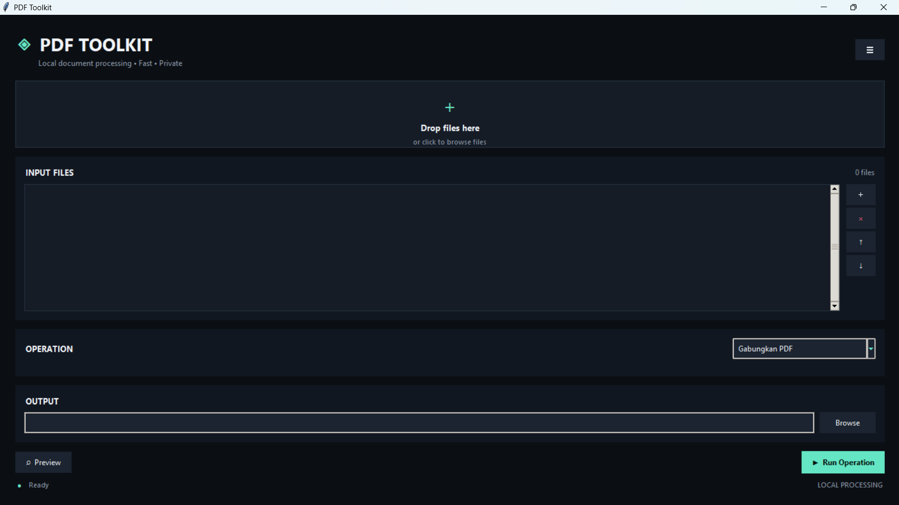

<div align="center">

# ◈ PDF Toolkit

### Fast, Private & Local PDF Processing Desktop Application

A modern desktop application for processing PDF documents locally with a clean, futuristic interface.

[](https://www.python.org/)
[](https://pymupdf.readthedocs.io/)
[](https://pypdf.readthedocs.io/)
[](https://python-pillow.org/)
[](#testing)
[](https://github.com/chaka-ranchaka/PDF-ToolKit/actions)

</div>

---

## 📖 About

**PDF Toolkit** is a Python-based desktop application designed to provide a collection of essential PDF processing tools in a single, simple interface.

Instead of relying on multiple online PDF services, PDF Toolkit performs document processing **locally on the user's computer**.

This approach makes the application suitable for workflows where document privacy is important, while also keeping the processing experience fast and straightforward.

The application combines PDF manipulation, image processing, document conversion, and a modern graphical interface into one lightweight toolkit.

### Design Principles

- 🔒 **Private** — Documents are processed locally.
- ⚡ **Fast** — Designed for direct desktop processing.
- 🖥️ **Simple** — Common PDF operations are accessible from one interface.
- 🧩 **Modular** — PDF operations are separated from the GUI layer.
- 🧪 **Tested** — Core functionality is covered by automated tests.
- 🚀 **Extensible** — The architecture allows additional PDF features to be added later.

---

## ✨ Features

PDF Toolkit currently provides the following operations:

| Feature | Description |
|---|---|
| 📎 Merge PDF | Combine multiple PDF files into a single document |
| 📑 Merge Selected Pages | Combine selected pages from PDF documents |
| ✂️ Split PDF | Split a PDF into multiple documents |
| 🗑️ Remove Pages | Remove selected pages from a PDF |
| 🔄 Rotate Pages | Rotate selected pages |
| 🔀 Reorder Pages | Rearrange PDF page order |
| 🖼️ Extract Images | Extract embedded image objects from PDF documents |
| 📦 Compress PDF | Reduce PDF size using PDF optimization |
| 🏷️ Watermark | Add text watermark with configurable settings |
| 🖼️ Images to PDF | Convert multiple images into a PDF document |
| 📄 Convert PDF | Convert PDF content into TXT, HTML, or DOCX |
| 🎨 Change PDF Color | Convert pages into Original, Grayscale, or Black & White |

---

## 🖥️ Interface

PDF Toolkit uses a dark, minimalistic interface with a futuristic visual style.

The main interface provides:

- Drag & drop file input
- Input file management
- Operation selector
- Dynamic operation options
- Output file selection
- PDF preview
- Processing status
- Settings panel
- Local processing indicator

<div align="center">



</div>

---

## 🎨 Color Conversion

PDF Toolkit includes a dedicated PDF color conversion feature.

Available modes:

### Original

Keeps the original PDF appearance.

### Grayscale

Converts every page into grayscale.

### Black & White

Converts every page into a binary black-and-white representation.

The conversion resolution can also be configured through the DPI setting.

Supported DPI range:

```text
72 - 300 DPI
```

> **Technical note:** Color conversion rasterizes each PDF page into an image before creating the output PDF. As a result, the converted document does not preserve the original PDF's internal vector/text object structure.

---

## 🖼️ Image Extraction

PDF Toolkit can extract image objects embedded within PDF pages.

The extracted images are saved separately from the original document.

> **Current limitation:** Some PDFs store visual content as multiple separate image objects. In those cases, the extractor may return partial image regions such as fragments of photos, page corners, or other individual PDF image objects. The current implementation does not intelligently reconstruct or group these fragments into the original complete image.

---

## 🏗️ Project Architecture

The project separates the graphical interface, command-line interface, file utilities, and PDF processing logic.

```text
PDF-ToolKit/
│
├── pdf_toolkit/
│   ├── __init__.py
│   ├── cli.py
│   ├── file_utils.py
│   ├── gui.py
│   └── pdf_operations.py
│
├── tests/
│   └── test_pdf_operations.py
│
├── docs/
│   ├── dashboard_PDFToolkit.png
│   └── logo_PDFToolkit.png
│
├── .github/
│   └── workflows/
│       └── tests.yml
│
├── main.py
├── requirements.txt
├── .gitignore
└── README.md
```

### Core Modules

#### `pdf_toolkit/pdf_operations.py`

Contains the main PDF processing functionality.

Examples include:

- PDF merging
- PDF splitting
- Page manipulation
- Image extraction
- PDF compression
- Watermark generation
- Document conversion
- Image-to-PDF conversion
- Color conversion

#### `pdf_toolkit/file_utils.py`

Provides reusable file validation and output handling utilities.

#### `pdf_toolkit/gui.py`

Contains the desktop graphical interface built with Tkinter.

The GUI is responsible for:

- File selection
- Drag & drop
- Operation selection
- Dynamic settings
- Preview
- Output configuration
- User interaction
- Processing feedback

#### `pdf_toolkit/cli.py`

Provides command-line functionality for PDF operations.

#### `tests/test_pdf_operations.py`

Contains automated tests for the core PDF processing functionality.

---

## 🛠️ Tech Stack

### Programming Language

- 🐍 Python 3.11+

### PDF Processing

- **pypdf**
- **PyMuPDF**

### Image Processing

- **Pillow**

### Document Generation & Conversion

- **ReportLab**
- **python-docx**

### Desktop GUI

- **Tkinter**
- **tkinterdnd2**

### Testing

- **pytest**

### Continuous Integration

- **GitHub Actions**

---

## 📦 Installation

### 1. Clone the repository

```bash
git clone https://github.com/chaka-ranchaka/PDF-ToolKit.git
cd PDF-ToolKit
```

### 2. Create a virtual environment

#### Windows

```powershell
python -m venv .venv
```

Activate the environment:

```powershell
.venv\Scripts\activate
```

#### Linux / macOS

```bash
python3 -m venv .venv
source .venv/bin/activate
```

### 3. Install dependencies

```bash
python -m pip install --upgrade pip
pip install -r requirements.txt
```

---

## ▶️ Running the Application

From the project root:

```bash
python main.py
```

The PDF Toolkit desktop application will launch.

---

## 🖱️ Basic Workflow

The general workflow is:

```text
Select / Drop PDF
        │
        ▼
Choose Operation
        │
        ▼
Configure Options
        │
        ▼
Choose Output
        │
        ▼
Run Operation
        │
        ▼
Generated PDF / Document
```

### Example

1. Open PDF Toolkit.
2. Drag one or more PDF files into the input area.
3. Select an operation.
4. Configure the required options.
5. Select the output location.
6. Click **Run Operation**.
7. The processed file is generated locally.

---

## 🔧 Available Operations

### Merge PDF

Combines multiple PDF documents into a single PDF.

```text
Input:
    document_1.pdf
    document_2.pdf
    document_3.pdf

Output:
    merged.pdf
```

---

### Merge Selected Pages

Allows selected pages from input documents to be combined.

Useful when only specific pages from several PDF documents are required.

---

### Split PDF

Splits a PDF into multiple PDF documents based on page ranges.

Example:

```text
1-3
4-6
7-10
```

---

### Remove Pages

Removes selected pages from a PDF document.

Example:

```text
Remove:
2, 5, 8
```

---

### Rotate Pages

Rotates selected PDF pages.

Useful for correcting page orientation.

---

### Reorder Pages

Changes the order of pages in a PDF document.

Example:

```text
Original:
1 → 2 → 3 → 4

New:
3 → 1 → 4 → 2
```

---

### Extract Images

Extracts image objects contained inside PDF pages.

The output consists of the extracted image files.

---

### Compress PDF

Attempts to reduce PDF file size while maintaining a usable document.

---

### Watermark

Adds a text watermark to PDF pages.

The watermark functionality supports configurable parameters such as:

- Text
- Position
- Opacity
- Font size
- Rotation angle

---

### Images to PDF

Combines image files into a PDF document.

Useful for converting scanned pages, photos, or image collections into a single PDF.

---

### Convert PDF

Converts PDF content into several document formats.

Supported formats:

```text
TXT
HTML
DOCX
```

---

### Change PDF Color

Converts PDF pages into:

```text
Original
Grayscale
Black & White
```

DPI can be configured between:

```text
72 - 300 DPI
```

---

## 🧪 Testing

PDF Toolkit uses **pytest** for automated testing.

The test suite covers core functionality including:

- Page range parsing
- PDF merging
- PDF splitting
- Page removal
- Page rotation
- Page reordering
- Image extraction
- PDF compression
- Watermark generation
- TXT conversion
- HTML conversion
- DOCX conversion
- Images to PDF
- PDF color conversion
- File validation
- Temporary file handling
- Output validation

Run the complete test suite:

```bash
python -m pytest -v
```

For stricter deprecation checking:

```bash
python -m pytest -W error::DeprecationWarning -v
```

Current test coverage:

```text
102 tests
```

---

## 🤖 Continuous Integration

The repository uses **GitHub Actions** to automatically run the test suite.

The CI workflow is located at:

```text
.github/workflows/tests.yml
```

The workflow runs when changes are pushed to or submitted through pull requests targeting:

```text
main
master
```

The CI pipeline performs:

```text
Checkout Repository
        │
        ▼
Setup Python 3.11
        │
        ▼
Install Dependencies
        │
        ▼
Run pytest
        │
        ▼
Pass / Fail
```

This helps ensure that changes pushed to the repository do not unintentionally break existing functionality.

---

## 🔐 Privacy

PDF Toolkit is designed around **local document processing**.

Documents are processed on the local machine rather than being uploaded to an external PDF processing service.

This makes the application useful for documents that users prefer to keep on their own device.

> Local processing does not automatically guarantee complete system-level privacy. Temporary files, operating system caches, backups, or other software may still affect how data is stored on a user's computer.

---

## 📁 Requirements

The current runtime dependencies are:

```text
pypdf>=6.0
PyMuPDF>=1.24
Pillow>=10.0
reportlab>=4.0
python-docx>=1.1
tkinterdnd2>=0.4
pytest>=8.0
```

---

## 🚧 Current Limitations

PDF Toolkit is still under active development.

Current limitations include:

- Image extraction may return individual image fragments when a PDF stores visual content as multiple image objects.
- Image extraction does not currently reconstruct fragmented images into their original complete form.
- Color conversion rasterizes PDF pages, so original vector/text structures are not preserved in converted output.
- Advanced PDF features such as digital signatures, forms, annotations, and complex interactive elements may not be preserved by every processing operation.
- Some PDF documents may behave differently depending on how their internal structure was generated.

---

## 🗺️ Roadmap

Future improvements may include:

### PDF Processing

- [ ] Advanced PDF optimization
- [ ] Better image extraction and reconstruction
- [ ] PDF metadata editor
- [ ] Page thumbnails
- [ ] Page-level preview
- [ ] PDF encryption and password protection
- [ ] PDF unlock functionality for supported documents
- [ ] Header and footer tools

### User Interface

- [ ] Improved page preview
- [ ] Drag-to-reorder pages
- [ ] Operation history
- [ ] Progress bar for long operations
- [ ] More detailed processing logs
- [ ] Keyboard shortcuts
- [ ] Improved responsive layout

### Distribution

- [ ] Windows standalone `.exe`
- [ ] Application installer
- [ ] Portable version
- [ ] Release automation

### Developer Experience

- [x] Automated tests
- [x] GitHub Actions CI
- [x] Modular PDF processing backend
- [ ] Automated release workflow
- [ ] Expanded test coverage

---

## 💡 Why PDF Toolkit?

There are many online PDF tools available, but they often require users to upload their documents to a remote service.

PDF Toolkit takes a different approach:

```text
              ONLINE PDF TOOLS

     Document
         │
         ▼
    Upload to Server
         │
         ▼
     Processing
         │
         ▼
      Download
```

PDF Toolkit:

```text
              PDF TOOLKIT

     Document
         │
         ▼
   Local Processing
         │
         ▼
     Output File
```

The goal is simple:

> **Useful PDF tools without requiring your documents to leave your computer.**

---

## 🎯 Project Goals

PDF Toolkit was developed as a practical exploration of:

- Python desktop application development
- PDF document processing
- Image processing
- GUI development
- Software modularity
- Automated testing
- Continuous Integration
- Local-first application design

The project also serves as a foundation that can be extended into a more complete desktop document-processing application.

---

## 🧠 What This Project Demonstrates

This project demonstrates experience with several areas of software development:

```text
Python
  │
  ├── Desktop GUI
  │
  ├── PDF Processing
  │
  ├── Image Processing
  │
  ├── Document Conversion
  │
  ├── Automated Testing
  │
  ├── Error Handling
  │
  └── Continuous Integration
```

---

## 📸 Screenshots

### Main Dashboard

<div align="center">


</div>

---

## 📌 Project Status

**Development Status:** 🟢 Active Development

The core PDF processing functionality is implemented and covered by automated tests. The graphical interface is also under continuous refinement as new features are introduced.

---

## 👨‍💻 Author

<div align="center">

### Muhammad Naufal Al Ghazali

Electrical Engineering Student  
Interested in Software Development, AI, Computer Vision, Embedded Systems, IoT, Flutter, and Web Development.

<br>

[](https://github.com/chaka-ranchaka)

</div>

---

## 📄 License

No license has been specified for this repository yet.

If this project is intended to be publicly reused, a license can be added in a future release.

---

<div align="center">

### ◈ PDF Toolkit

**Local document processing · Fast · Private**

Built with Python 🐍

</div>
